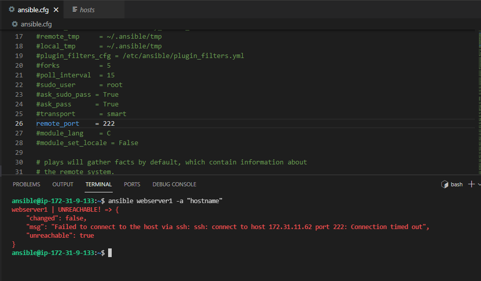

# Ansible Assignment 1

## Run adhoc commands based on the following conditions:

- Due to resources constraint, Run specific commands on all remote hosts one at a time.
- Setup solution which collects the minimal amount of system-related information from a remote host 
- Change the location of the default inventory file without using the Adhoc flag
- Create an inventory file with the .py extension and update the file path in the config file. But while running the commands that inventory file should not work.
- While using Ansible ad-hoc command without any module, it should print ping-pong output
- Due to security reasons, the organization modified the SSH default port to some random port, make sure while using ansible, we don't have to provide or change 
  ansible port for every host and it should work for all.
- While using Ansible, it should pick random user [ example - ninja ] as default instead of root.
- While login into remote servers, it should use the default private key if not provided.
- As display output doesn't require color output, how can we disable colors from the output while using ansible commands
- How can we get information of remote hosts which have failed to execute properly and rerun the same commands only for failed hosts
- Run commands on the basis of different strategy and how it is different from each other. Use at least 4 hosts

### Below are the Tasks and Steps followed 

#### Task 1: Due to resources constraint, Run specific commands on all remote hosts one at a time.

**Step 1:** Ran "hostname" command on host webserver1 and appserver1.

#### Task 2: Setup solution which collects the minimal amount of system-related information from a remote host 

**Step 1:** Used setup module and applied filter parameter to fetch os distribution of host webserver1

#### Task 3: Change the location of the default inventory file without using the Adhoc flag

**Step 1:** Changed the location of the default inventory file in the ansible configuration file 

#### Task 4: Create an inventory file with the .py extension and update the file path in the config file. But while running the commands that inventory file should not work.

**Step 1:** Ran hostname command, as you can see it is working currently.

**Step 2:** Created another copy of host file and named it as host.py , changed the default inventory file to host.py in the ansible config file.

**Step 3:** Ran command hostname again, as you can see it's still working.

**Step 4:** Added the .py extension in the ignore_extensions in the inventory section of the ansible config file. ran the hostname command again, as you can see it's giving an error.

#### Task 5: While using Ansible ad-hoc command without any module, it should print ping-pong output

**Step 1:** Edited the default module name to ping module in the ansible config file. Ran the ad-hoc command.

#### Task 6: Due to security reasons, the organization modified the SSH default port to some random port, make sure while using ansible, we don't have to provide or change ansible port for every host and it should work for all.

**Step 1:** Changed the default remote port in ansible file to 222. Ran the command hostname, as you can see it is giving an error.

**Step 2:** Opened port 222 for host webserver1

**Step 3:** Changed ssh port to 222 in sshd_config file of host webserver1

**Step 4:** Restarted the sshd services.

**Step 5:** Ran the hostname command again on host webserver1, as you can see below it's working now.

#### Task 7: While using Ansible, it should pick random user [ example - ninja ] as default instead of root.

**Step 1:** Changed the remote_user in the ansible config file to another user (here, suyash)

#### Task 8: While login into remote servers, it should use the default private key if not provided.

**Step 1:** Commented the ansible_ssh_private_key_file parameter in the hosts file.

**Step 2:** Passed the private key path in the private_key_file parameter in the ansible config file. Ran the hostname command on webserver1, as you can see it is working

#### Task 9: As display output doesn't require color output, how can we disable colors from the output while using ansible commands

**Step 1:** Ran the hostname command, currently the output has yellow color. 

**Step 2:** Uncommented the nocolor parameter in the ansible config file and set it to 1. Ran the hostname command again, as you can see the output does not have any color now.

#### Task 10: How can we get information of remote hosts which have failed to execute properly and rerun the same commands only for failed hosts

**Step 1:** Edited the ansible config file and set the retry_files_enables to true and provided a path for the retry file to parameter retry_files_save_path

#### Task 11: Run commands on the basis of different strategy and how it is different from each other. Use at least 4 hosts

**Step 1:** By default Ansible uses the linear strategy, but ansible offers two other strategies as well, debug and free strategy. We can change ansible default strategy by editing the strategy parameter in the sansible config file.

