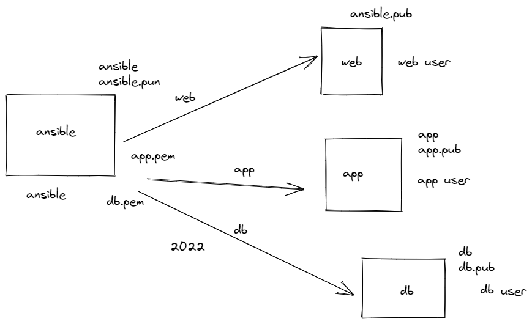
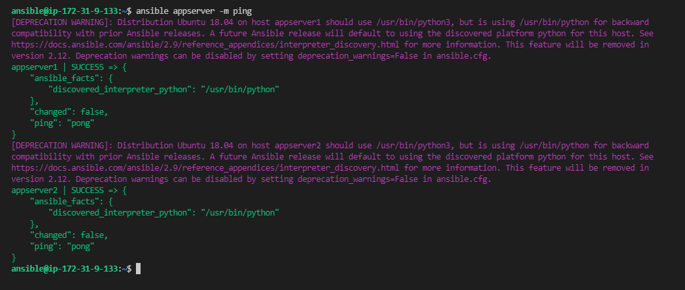
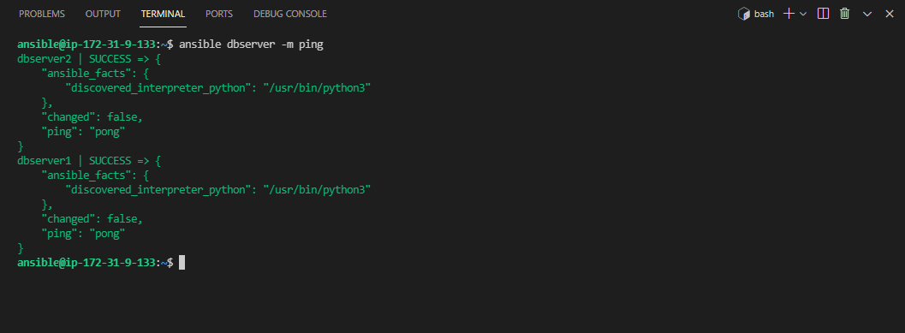
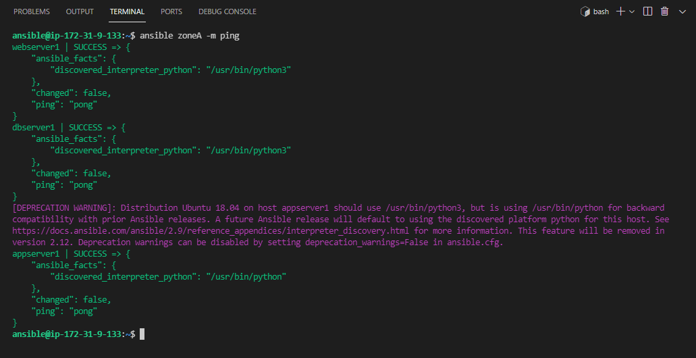
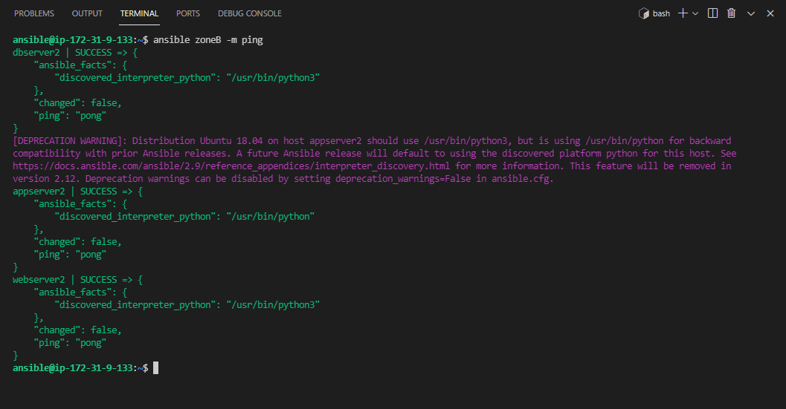

## Ansible Assignment 2

Learning by Doing | Static Inventory

Introduction
In this section we will explore how ansible manages static inventory

References

https://docs.ansible.com/ansible/latest/user_guide/intro_inventory.html

Prerequisites
For this assignment you have to simulate an infrastructure where you have below simulated machines, it can be one machine as well.

Three users should be present on your machine web, app and db.
Place ubuntu key-pair in web home directory and user should be able to do password less login.
Generate key pair for app user and it should be using its key for doing ssh.
Same as well db there should be a seperate key pair for doing ssh.

Assignments
For this assignment you have to simulate an infrastructure where you have below simulated machines, it can be one machine as well

web server 1 in zone A, reachable by web user from your machine
web server 2 in zone B, reachable by web user from your machine
app server 1 in zone A, reachable by app user from your machine, using app.pem key.
app server 2 in zone B, reachable by app user from your machine, using app.pem key
db server 1 in zone A, reachable by db user from your machine, using db.pem key and ssh port would be 2022

db server 2 in zone B, reachable by db user from your machine, using db.pem key and ssh port would be 2022

Must Do

Try to reach out all web servers using ansible ping command
Try to reach out all app servers using ansible ping command
Try to reach out all db servers using ansible ping command
Try to reach out all zone A servers using ansible ping command
Try to reach out all Zone B servers using ansible ping command
Submit your inventory file as solution

Good to Do

Do the solution for same problem statement using yaml file.

Summary
In this section we have gone through ansible static inventory

Host
Group
Group of Groups
Variables
Externalizing variables
Variables Merging
Behaviral Inventory parameters

#### Workflow Diagram

#### Task 1: Connectivity to webservers using ansible ping command 

#### Task 2: Connectivity to appservers using ansible ping command 

#### Task 3: Connectivity to dbservers using ansible ping command 

#### Task 4: Connectivity to ZoneA servers using ansible ping command 

#### Task 5: Connectivity to ZoneB servers using ansible ping command 

#### Task 6: Inventory File used.

