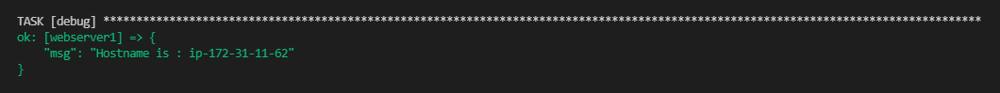
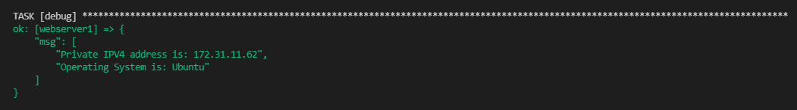
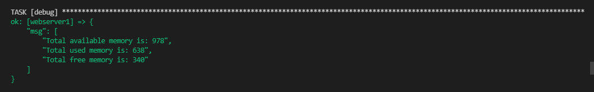
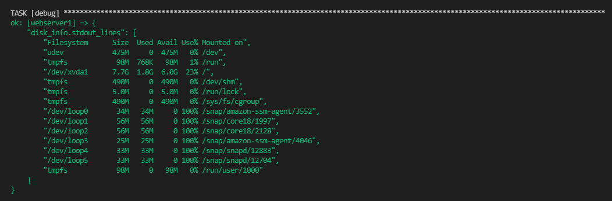
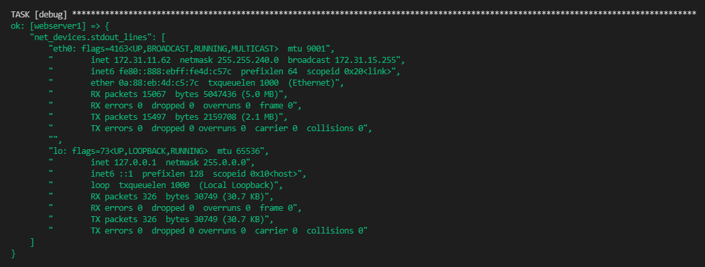

## Ansible Assignment 4

For this assignment we will use the setup created in our previous assignment

Must do

Write a playbook to create a user along with below steps.

- Home directory as /home/username
- Provide shell /bin/bash
- Create a group and add user into that group.

Write a playbook to fetch system info like

- Hostname
- IP addresses (public, private)
- Operating System
- RAM information (total, used, free)
- Disk information (total,used, free)
- Available Network Devices.

Write a playbook to install nginx along with below steps.

- Start nginx service
- Stop nginx service
- Along with hosting a custom HTML Page on it displaying your Name and system information which we are fetching above.
- Restart nginx service

Good to do

- Write a playbook to install nginx only when /var/www/html/index.nginx-debian.html file doesn't exist.
- Write a playbook to install multiple packages in a single play (using loops).

Summary: In this section we have gone through some of the important ansible modules

- user
- setup
- package
- service
- copy

#### Host node fetched details

**Hostname :**

**IP Address and OS Distribution :**

**RAM Information (total, free, used) :**

**Disk Information :**

**Available Network Devices :**

#### Nginx index.html page 

