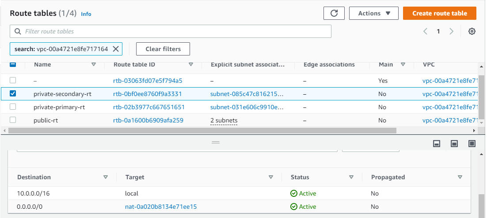

# AWS Network Infrastructure

We need to setup infra for our Salary Micro-Service on AWS instance so we need to follow below steps:
- First we need to create Infrastructure Diagram for infra of Salary Micro-Service along with ElasticSearch.
- Create the infra on the basis of your infrastructure diagram.
Make sure your infra considers below points
- Make sure your setup is highly available.
- Make sure your setup is secure and is not expose to outer world.
You have to setup infra for below 2 applications
- VM for hosting salary app
- VM for hosting ES app

- [github repo](https://github.com/opstree/OT-Microservices-Training.git)

# Infrastructure Diagram


# Steps Followed

Step 1: Created a VPC 
- tag = salary-VPC
- CIDR = 10.0.0.0/16


Step 2: Created four subnets 

- salary-public-primary (CIDR = 10.0.0.0/24)
- salary-public-secondary (CIDR = 10.0.1.0/24) 
- salary-private-primary (CIDR = 10.0.2.0/24) 
- salary-private-secondary (CIDR = 10.0.3.0/24)


Step 3: Created Internet Gateway (tag = salary-IGW)


Step 4: Created Nat Gateway (tag = salary-NGW) and associated an Elastic IP to it.


Step 5: Created three route tables.

- public-RT
- private-primary-RT
- private-secondary-RT

Step 6: Associated public-RT with both the public subnets, edited it's route and added IGW as target


Step 7: Associated "private-primary-RT" to "salary-private-primary" subnet and "private-secondary-RT" to "salary-private-secondary" subnet. Edited both the route tables and added NGW as target.




Step 8: Created 5 instances. Below is the subnet details in which the instances are created.

salary-public-primary 
- bastion-host 

salary-private-primary
- salary-primary
- primary-database 

salary-private-secondary
- salary-secondary
- secondary-database 


Step 9: Created a Load balancer (tag=salary-ALB), added both the salary servers to its target group "salary-TG".

- Load balancer (salary-ALB)


- Target Group (salary-TG)


- ALB security group (alb-SG)


Step 10: Edited bastion-host security group and opened port 22 on it for my IP.


Step 10: Edited salary servers security group to open:
- port 22 for bastion-host
- port 80 for Load balancer 
- port 8082 for salary application


Step 11: Edited database server security group to allow:
- port 22 for bastion-host
- port 8082 for salary servers
- port 9200 for Elasticsearch


Step 12: Took ssh of bastion-host and from the bastion-host took ssh of salary-servers and performed below steps to successfully install and run salary app.

```bash
  sudo apt-get update -y
  sudo apt-get upgrade -y
  sudo apt-get install make -y
  sudo apt-get install golang-go -y
```
- Git clone operation:

```bash
  git clone https://github.com/opstree/OT-Microservices-Training.git
```

- Ran the make build command:

```bash
  cd OT-Microservices-Training/salary
  make build 
```

- Added salary application CONFIG_FILE variable to the .bashrc file 

```bash
  CONFIG_FILE=/home/ubuntu/OT-Microservices-Training/salary/config.yaml
  export CONFIG_FILE
```

- Edited config.yaml file and added Elastic search IP and port to it.

```bash
  # elasticsearch connection details
      elasticsearch:
      enabled: true
      host: http://elastic:9200
      username: elastic
      password: elastic

  # Salary application api port
    salary:
      api_port: "8082"
```

- Repeated the same steps for the salary-secondary server as well.

Step 13: Took ssh of database servers from the bastion-host and installed elasticsearch on both the servers.

- Followed the documentation for installation:
[Documentation](https://www.elastic.co/guide/en/elasticsearch/reference/current/docker.html)

- Started Elasticsearch

Step 14: Took ssh of salary servers again and ran the salary application:

```bash
  ./salary
```
- salary-primary


- salary-secondary


Step 15: From the browser made a hit to the load balancer DNS:


