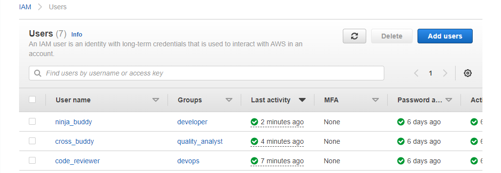

# IAM(Authentication Management) Assignment

## What you will learn from this lab
- IAM(Authentication Management)
    - User Creation
    - Group Creation
    - Roles
    - Policies
## Resources Details
- EC2
- S3
- CloudWatch
- Route53
## Task Description

### Task 1
Create 3 Group's
- #### 1. Devloper
    - set of permissions:
        - ec2 
            - start
            - stop
            - change instance type
            - read
        - S3
            - create
            - list
            - get
            - put
        - CloudWatch
            - read only
        - Route53
            - read only
- #### 2. DevOps
    - set of permissions:
        - DevOps should be able to manage all resources along with permission management.
- #### 3. QA:
    - set of permissions:
        - S3
            - list 
            -  get
        - EC2
            - read only
        - Cloudwatch
            - read only

**create 3 user for your ninja buddy ,cross-buddy,code-reviewer and assign them one Group to each and verify permissions**

### Task 2

- Create a role for EC2 which will have permissions for
    - S3
        - list
        -  get
        - put
        - create
- Now create a EC2 and attach the created role to it
- Using aws-cli create a s3 bucket 
- Using EC2 machine and try listing s3 bucket

## Steps Followed for Task 1

#### Step 1: 
Created 3 groups : **developer**, **devops** and **quality_analyst**


#### Step 2:
Created 3 users : **ninja_buddy**, **code_reviewer** and **cross_buddy**



#### Step 3:
Assigned ninja_buddy user to developer group, code_reviewer user to devops group and cross_buddy user to quality_analyst group. 


#### Step 4:
Created three policies using AWS console : **developer_policy**, **devops_policy** and **qa_policy**. Permissions are as follows :

- **developer_policy**
    - set of permissions:
        - ec2 
            - start
            - stop
            - change instance type
            - read
        - S3
            - create
            - list
            - get
            - put
        - CloudWatch
            - read only
        - Route53
            - read only
- **devops_policy**
    - set of permissions:
        - EC2
          - All permissions
        - S3
          - All permissions
        - Cloudwatch
          - All permissions
        - Route 53
          - All permissions
- **qa_policy**
    - set of permissions:
        - S3
            - list 
            -  get
        - EC2
            - read only
        - Cloudwatch
            - read only

#### Step 5:
Assigned developer_policy to developer group, devops_policy to devops group and qa_policy to quality_analyst group. 


## Steps Followed for Task 2

#### Step 1:
Created a policy called **role_policy** and assigned the below permissions :
- S3
  - list
  - get
  - put
  - create


#### Step 2:
Created a role **ec2_role** and attached role_policy to it.


#### Step 3:
Created an EC2 machine and attached ec2_role to my ec2 machine. **(Modified > Security > Modify IAM role)**


#### Step 4:
Create a bucket **task2-3s** by running the command : 

```bash
aws s3 mb s3://task2-3s
```

#### Step 5:
Listed available buckets by running command : 

```bash
aws s3 ls
```


