## What you will learn from this lab
- S3
- Hosting a static site in s3
- Cloudfront (CDN)
- Route 53

## Task Description 
- Create 2 S3 buckets 
    -  With console (bucket name = ninja) 
    -  With CLI (bucket name= BuddyName) 
- create 2 index.html page 
    - With content "Hi ninja" 
    - With "Hi buddy name"
- Upload index.html with "Hi ninja" using AWS console on ninja bucket.
- Upload index.html inside folder 'ninja', with "Hi Buddy" using AWS CLI  on BuddyName bucket.
- Configure CloudFront for both s3 buckets in such a fashion that CloudFront should open "Hi ninja" on default and cloudfront dns/ninja should display "Hi buddy"
 **S3 should not be publicly open (Only accessible through CloudFront using bucket policy and OAI)**
- Arrange a domain from any registrar(eg: try to get it free or cheapest ;-) )  
- Create a public hosted zone with the existing domain
- Now create a recordset  for mapping your  CloudFront DNS with {your_name}.{your_domain} which is hosting your previously created website 
    - eg: Pankaj.crazy traveller.ga should open your website. (where "Pankaj" is name and "dcrazytraveller.ga" is your domain)

##  Good To Do
- Create a private hosted zone (choice of your domain) and attach it to your VPC.
- Now create a recordset  for mapping your  CloudFront DNS with {your_buddy_name}.{your_domain} which is hosting your previously created website 
- Do the same activity as done in the public-hosted zone.
    - Now try accessing it from your local machine.
    - Create an EC2 instance in your VPC and try accessing the same domain from your machine.

## Steps Followed 

#### Step 1
Created 2 S3 bucket **ninja-3s** and **buddy-3s** without public access. Created a folder **ninja** inside bucket "buddy-3s"

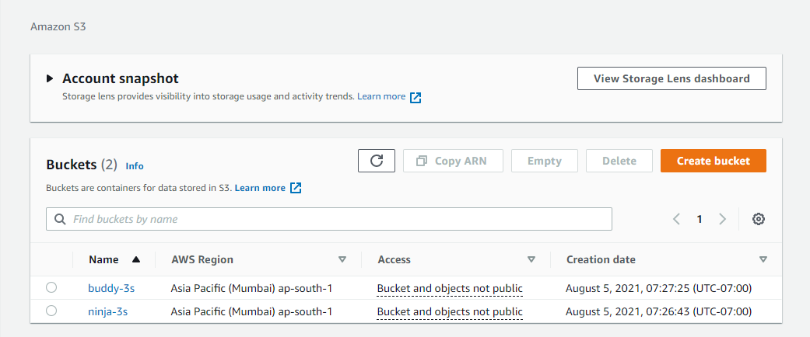

#### Step 2
Created 2 index.html file one with content "**This is Ninja's bucket**" and another with content "**This is Buddy's bucket**"

```
<!DOCTYPE html>
<html>
<head>
<title>This is Ninja's bucket</title>
</head>
<body>

<h1>This is a Heading</h1>
<p>This is a paragraph.</p>

</body>
</html>
```

```
<!DOCTYPE html>
<html>
<head>
<title>This is Buddy's bucket</title>
</head>
<body>

<h1>This is a Heading</h1>
<p>This is a paragraph.</p>

</body>
</html>
```

#### Step 3
Uploaded index.html with content "This is Ninja's bucket" on "**ninja-3s**" bucket.

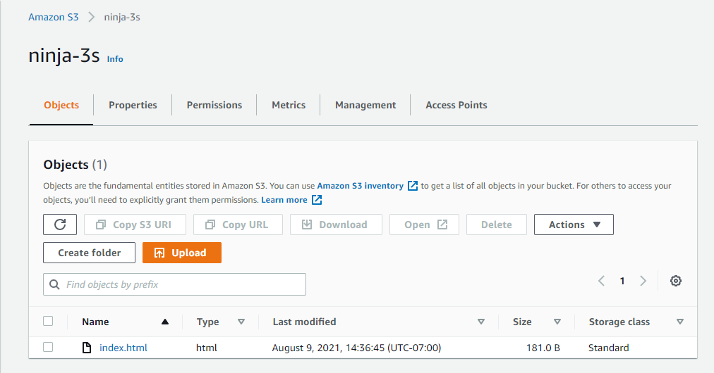

#### Step 4
Uploaded index.html with content "This is Buddy's bucket" on "**buddy-3s**" bucket inside ninja folder.

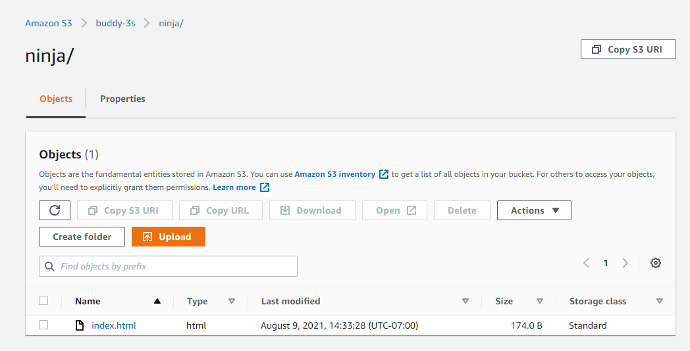

#### Step 5
Configure CloudFront for both S3 buckets in such a fashion that CloudFront should open "This is Ninja's Bucket" on default and cloudfront dns/ninja should display "This is Buddy's Bucket"

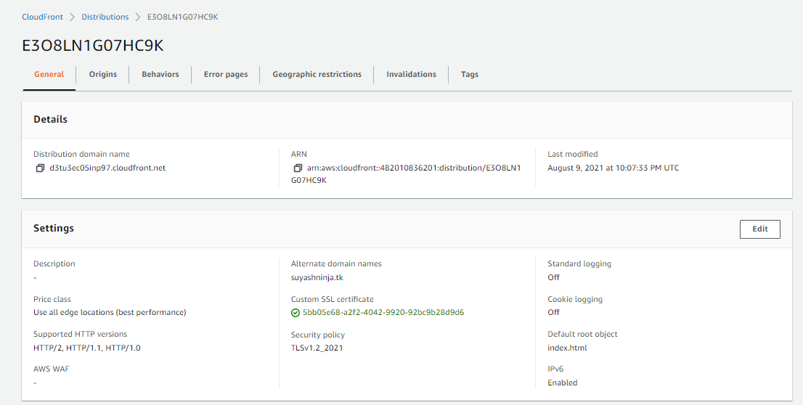

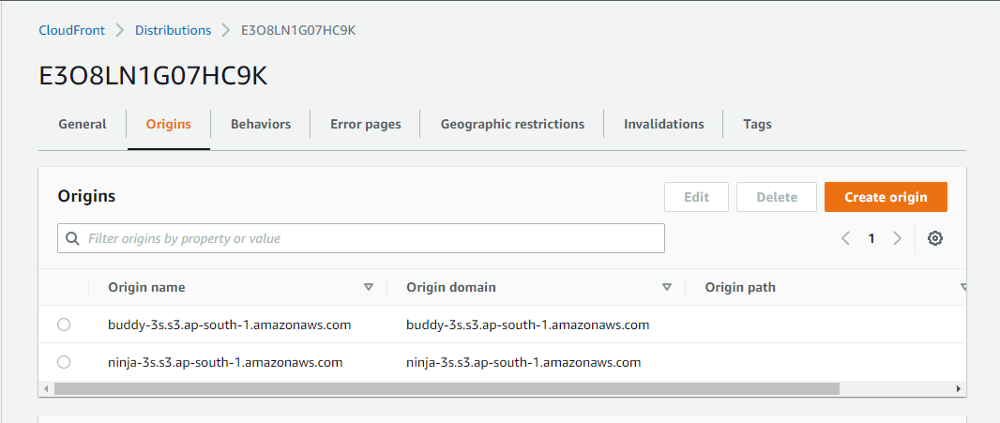

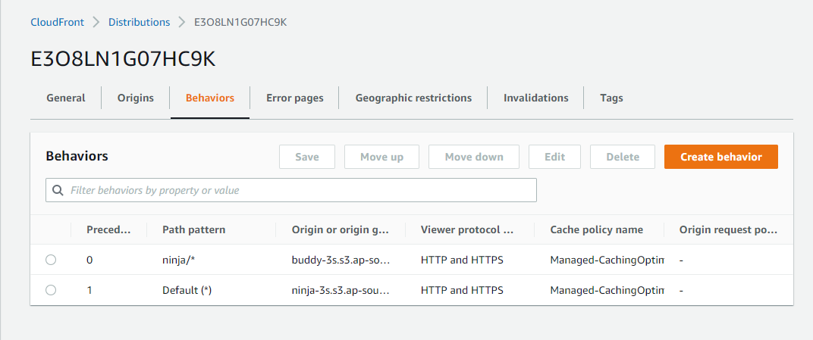

#### Step 6
Now when hit using cloudfront distribution dns in the browser, it displays ninja-3s bucket index file content "This is Ninja's Bucket" and when hit using dns/ninja it displays buddy-3s index file content "This is Buddy's Bucket" 

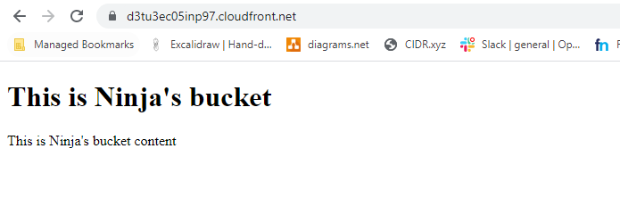

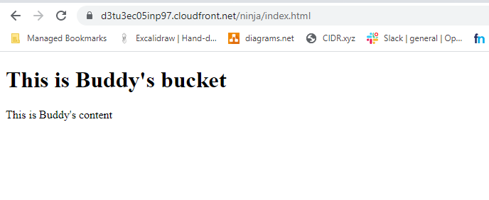

#### Step 7
Arranged a domain name "**suyashninja.tk**" from freenom.com

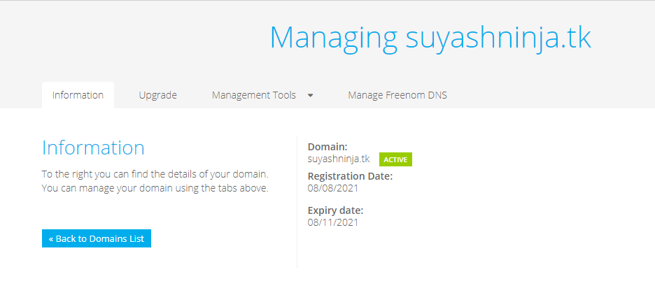

#### Step 8
Created a public hosted zone with domain name suyashninja.tk

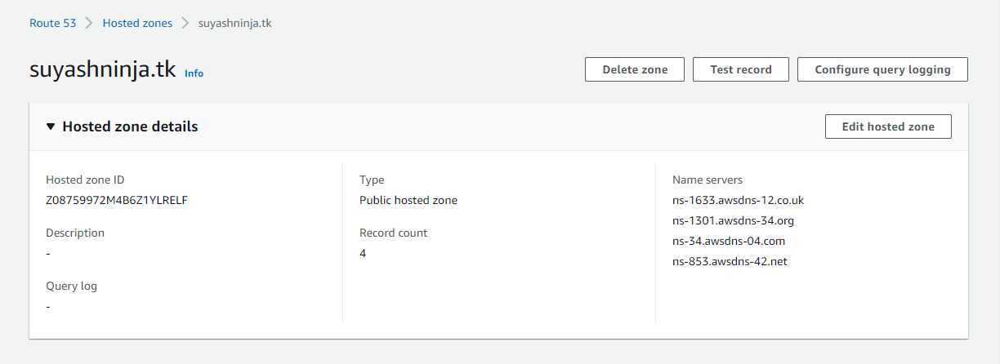

#### Step 9
Added the name servers from my public hosted zone to the domain name server in freenom.

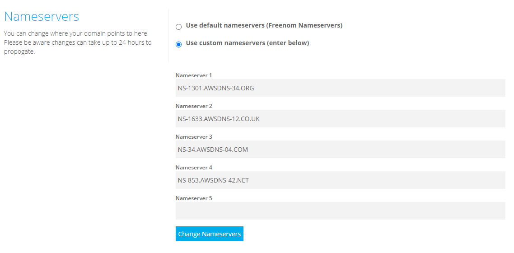

#### Step 10
Issued certificate for my domain.

#### Step 11
Added the certificate in cloudfront and also edited the alternate domain name to my domain. 

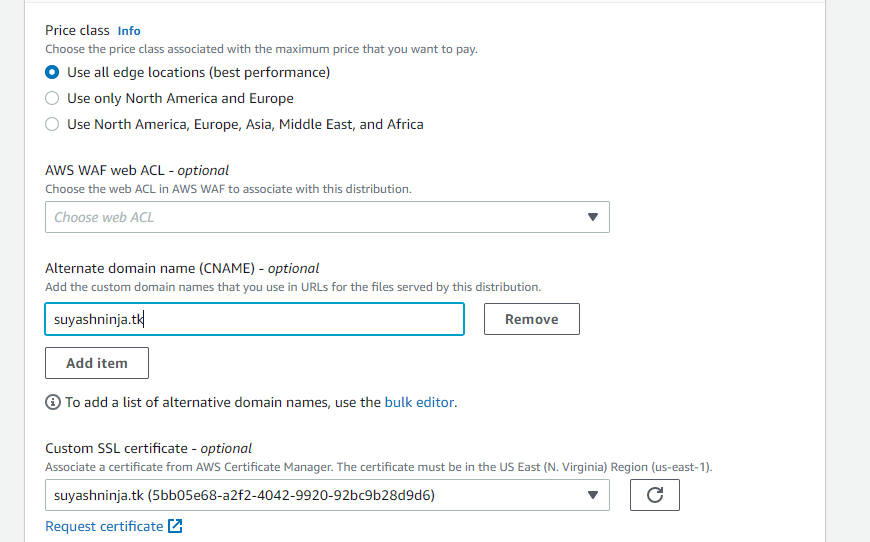

#### Step 12
After this created record in my hosted zone and added the cloudfront distribution dns to route traffic to it.

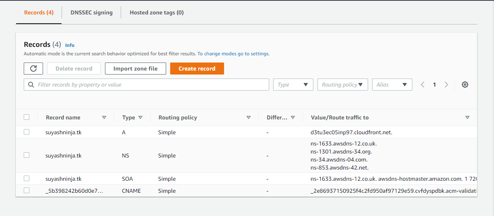

#### Step 13
Now when hit using my domain name in browser it displays ninja-3s bucket index file content "This is Ninja's Bucket" and when hit using domain/ninja it displays buddy-3s index file content "This is Buddy's Bucket"

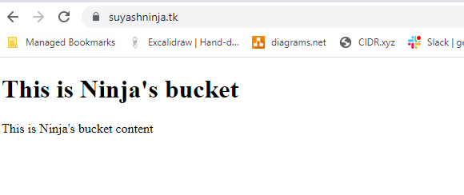

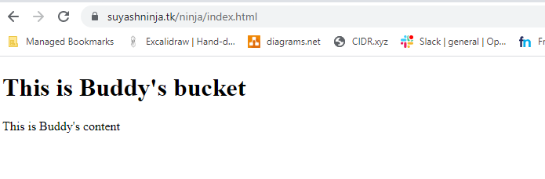