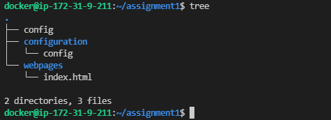

## Assignment 1

Create a utility to host a static website via Docker with below features:

- The website should be accessed via your team domain name i.e
    - name.team-name.com
    - opstree.ntd.com
- The website should be up and running in below intervals
    - 10-12
    - 4-6
- Modify the utility so that in which first half it would be printing your name and in second half your buddy name. i.e below will be the output of curl command
    - 10-12 | Hello from Opstree
    - 4-6 | Hello from TEAM-NAME

First do it manually

Then create a utility.

## Steps Followed 

**Step 1:** Created a directory called webpages and created an **index.html** file in it.

**Step 2:** Created another directory called configuration and created **config** file in it.



**Step 3:** Ran the container with the below flags 
- **--name :** to provide a **custom name** for container 
-  **-p :** for **port mapping** from local machine to container port
-  **-v :** used bind mount here to mount **"/home/docker/assignment1/webpages"** directory to **"/usr/share/nginx/html"** and **"/home/docker/assignment1/configuration"** directory to **"/etc/nginx/conf.d"**

```
docker run -itd --name webserver -v /home/docker/assignment1/configuration:/etc/nginx/conf.d -v /home/docker/assignment1/webpages:/usr/share/nginx/html -p 8080:80 nginx bash
```

**Step 4:** Accessed the container by using the below command :

```
docker exec -it webserver bash
```

**Step 5:** If Nginx services is stopped, start it.

```
service nginx start
```

**Step 7:** Now initiate a curl request from your docker host to access the webpage

```
curl localhost:8080
```

**Step 8:** Edited the cron files of your localhost user and added the below entries :

```
0 10 * * * echo "Hello from Opstree" > /home/docker/assignment1/webpages/index.html
0 12 * * * echo "" > /home/docker/assignment1/webpages/index.html
0 16 * * * echo "Hello from Whitewalker" > /home/docker/assignment1/webpages/index.html
0 18 * * * echo "" > /home/docker/assignment1/webpages/index.html
```

The webserver will now return **Hello from Opstree** from **10-12** and **Hello from Whitewalker** from **16-18**, while all other times it will return an empty page.


