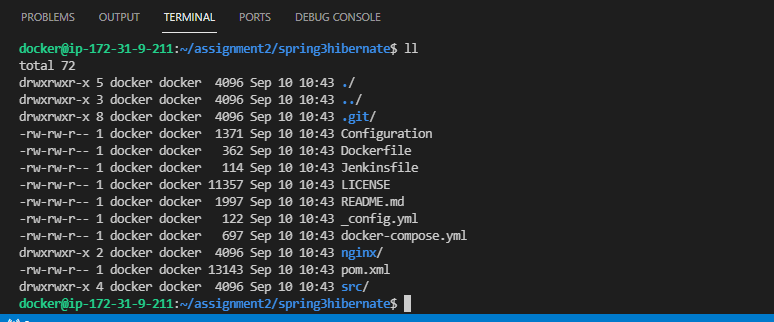
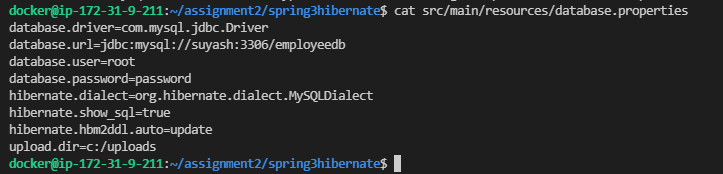
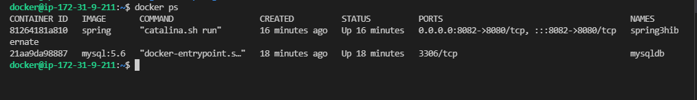
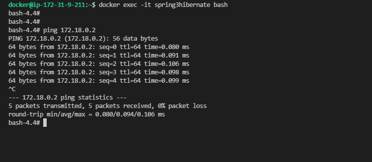
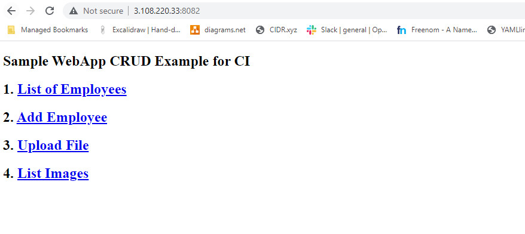
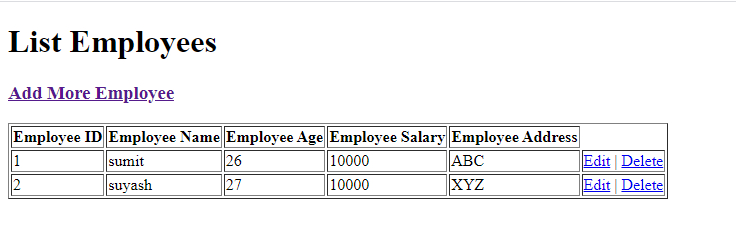

## Assignment 2 

In this assignment we will be learning about Port Mapping, Linking, Volume Mounting: - 

You have make sure your S3Hibernate App is up and running on Docker Container.

- Make sure one container for MySql is up. 
- Make sure you are able to ping MySql Container from S3H container. 
- Make sure your database connectivity is established.

https://github.com/opstree/spring3hibernate

Create One directory Structure :
- Ninjas
- Your Team members name

Now make sure that if this container is getting run by user then respective user should be able to Write on his/her respective Directory only and for others user should only be able to read it.

## Steps Followed 

**Step 1:** Used Git clone command to clone the repo 

```
git clone https://github.com/opstree/spring3hibernate.git
```



**Step 2:** Created custom network **suyash-network**

```
docker network create suyash-network
```

**Step 3:** Pulled **mysql:5.6** image

```
docker pull mysql:5.6
```

**Step 4:** Edited the **database.properties** file in the **src/main/resources** directory to add hostname in the database url :

```
nano src/main/resources/database.properties 
```



**Step 5:** Ran the image with the -e and -h flag for environment variable and hostname to create the container in the custom network:

```
docker run -d --name mysqldb -h suyash --network suyash-network -e MYSQL_ROOT_PASSWORD=password -e MYSQL_DATABASE=employeedb mysql:5.6
```

**Step 6:** Accessed the container using the below command :

```
docker exec -it mysqldb bash
```

**Step 7:** If the services are stopped, start the mysql service:

```
service mysql start 
```

**Step 8:** Build **spring3hibernate** image from the **Dockerfile**:

```
docker build -t spring .
```

**Step 9:** Ran the image with custom network to build the container. Use port mapping here to access the container from local machine :

```
docker run -d --network suyash-network -p 8082:8080 --name spring3hibernate spring
```



**Step 10:** Accessed the container using below command and checked the connectivity :

```
docker exec -it spring3hibernate bash
```



**Step 11:** Accessed the application from browser.




