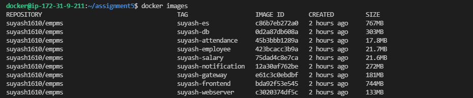
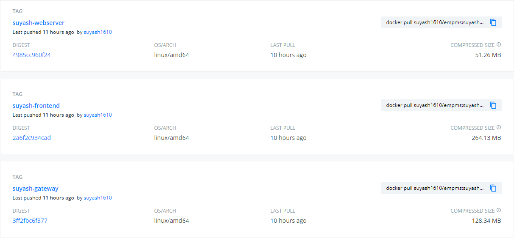
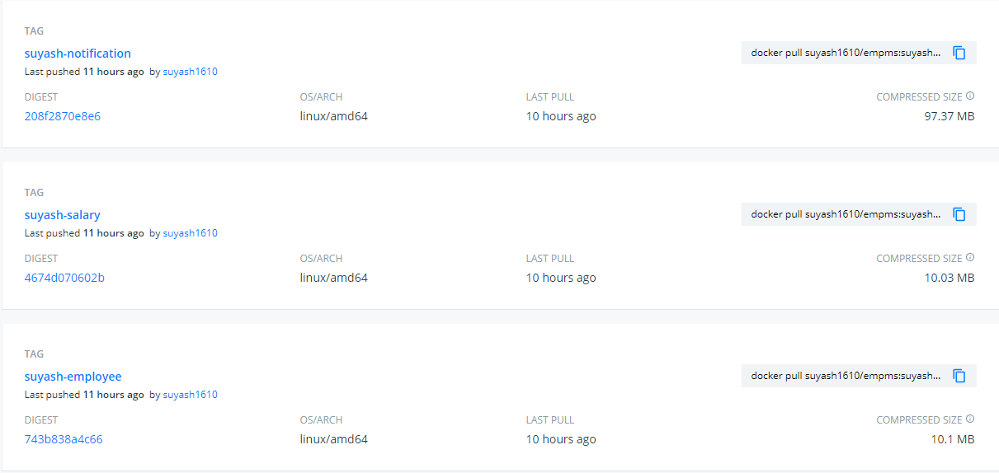
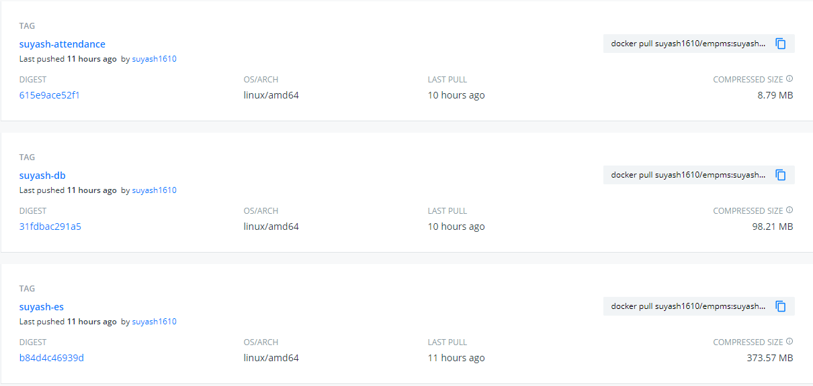
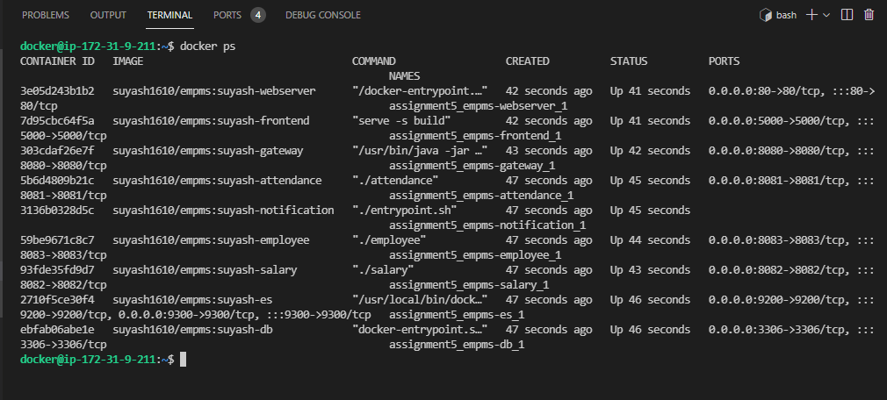
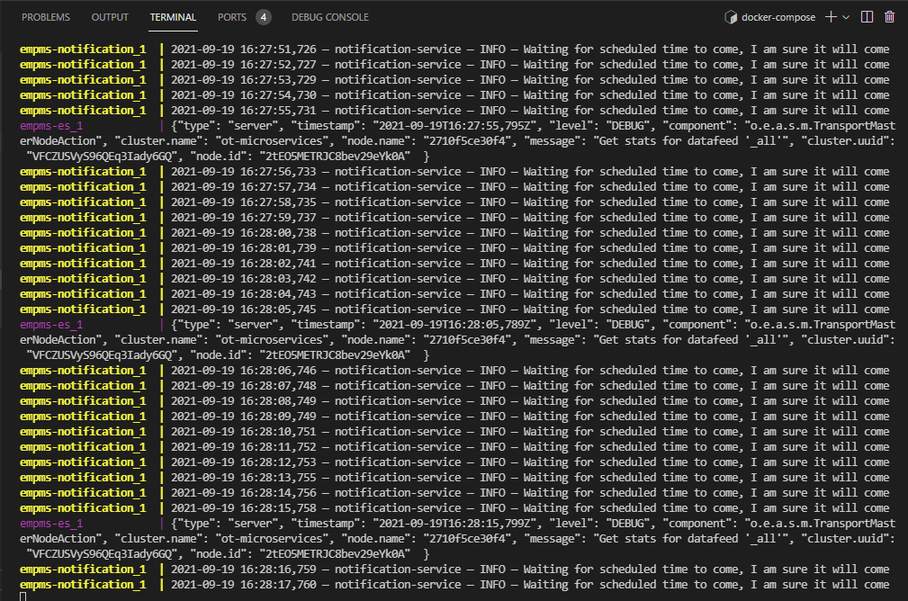
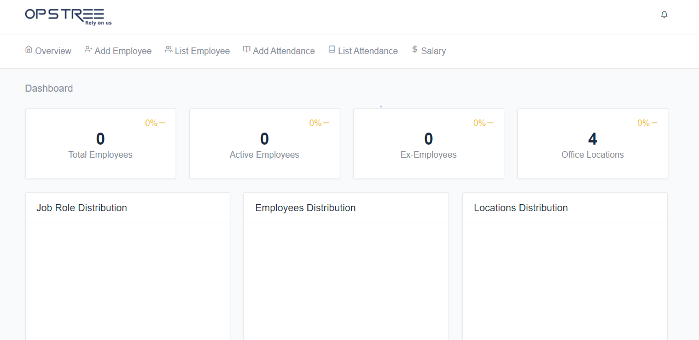
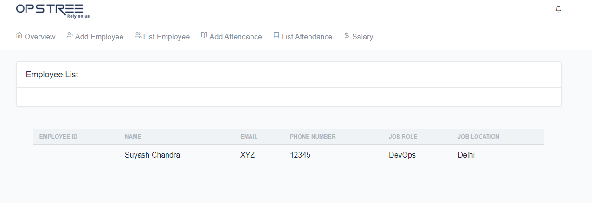
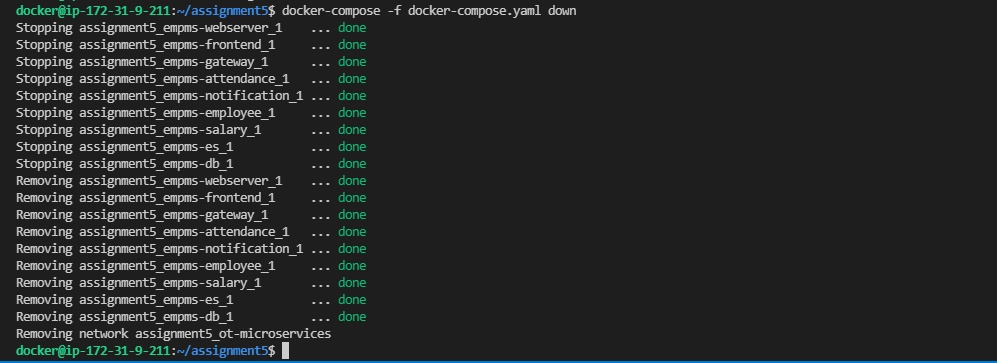

## Assignment 5

In this assignment we will be working on Docker-Compose file in pair of 2, for our OT-Microservice App:
- Step1: Setup the OT-MICROSERVICE  application fully Clone the code and run the app .
- Step2: Now delete the code from your local system and run the app fully
- Step3: Now your buddy in his/her system without cloning the code will run the app fully.
- Step4: Ensure your Employee, Salary and Attendance service are highly available.

**Bonus Assignment:** Also Explore other power features of docker compose i.e You only want to run Attendance and MySQL container. 

In a similar fashion try to explore other power feature of docker compose

## Steps Followed 

**Step 1:** Build all the images one by one with the **Dockerfile**

```
docker build -t [image_name:tag] .
```

**Step 2:** Ran the images with the necessary **configurations files** and **environament variables** to create containers for the application.

**Step 3:** Created **custom images** again from the running containers.

```
docker container commit [container_name] [image_name:tag]
```

Below are the build images: 



**Step 4:** Pushed the images to **docker hub**





**Step 5:** Now created **docker-compose.yaml** file and used the images from docker hub in it.

```
---
version: '3.2'

services:
  empms-es:
    image: suyash1610/empms:suyash-es
    volumes:
      - type: volume
        source: elasticsearch
        target: /usr/share/elasticsearch/data
    ports:
      - "9200:9200"
      - "9300:9300"
    networks:
      - ot-microservices

  empms-db:
    image: suyash1610/empms:suyash-db
    ports:
      - "3306:3306"
    networks:
      - ot-microservices

  empms-attendance:
    image: suyash1610/empms:suyash-attendance
    ports:
      - "8081:8081"
    networks:
      - ot-microservices
    depends_on:
      - empms-db

  empms-salary:
    image: suyash1610/empms:suyash-salary
    ports:
      - "8082:8082"
    networks:
      - ot-microservices
    depends_on:
      - empms-es

  empms-notification:
    image: suyash1610/empms:suyash-notification
    networks:
      - ot-microservices
    depends_on:
      - empms-es

  empms-employee:
    image: suyash1610/empms:suyash-employee
    ports:
      - "8083:8083"
    networks:
      - ot-microservices
    depends_on:
      - empms-es

  empms-gateway:
    image: suyash1610/empms:suyash-gateway
    ports:
      - "8080:8080"
    networks:
      - ot-microservices
    depends_on:
      - empms-attendance
      - empms-salary
      - empms-employee
      - empms-notification

  empms-frontend:
    image: suyash1610/empms:suyash-frontend
    ports:
      - "5000:5000"
    networks:
      - ot-microservices
    depends_on:
      - empms-gateway

  empms-webserver:
    image: suyash1610/empms:suyash-webserver
    ports:
      - "80:80"
    networks:
      - ot-microservices
    depends_on:
      - empms-frontend

networks:
  ot-microservices:
    driver: bridge

volumes:
  elasticsearch:
```

**Note:** Environment variables and the Configuration files needed are now already present inside the images. So, while running containers from these images we do not need to provide them in the docker compose file.

As we were needed to make a compose file that can be run from any system, the above mentioned environment variables and configuration files were needed to be included in the image itself.

**Step 6:** Ran the **docker-compose.yaml** file.

```
docker-compose -f docker-compose.yaml up
```

Below are the running containers :



Screenshot of running application :



**Step 7:** Accessed the application from the browser 

**Note:** The ports needed for the application needs to be opened.





**Step 8:** Stopped the running container with the below command :

```
docker-compose -f docker-compose.yaml down
```


