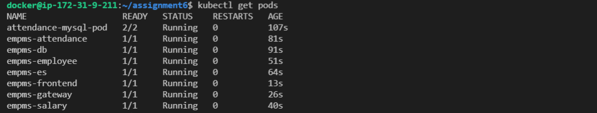

## Assignment 6

In this Assignment we will we creating pods for our OT-MICROSERVICE

- Step 1: Attendance Setup
    - Option 1: Run MySQL and attendance in different pods
    - Option 2: Attendance & MySQL in one pod Validation

- Step 2: Run ES, Run Salary and Ensure connectivity with ES

- Step 3: Run Employee and Ensure connectivity with ES 

- Step 4:
    - Run Frontend 
    - Run Webserver
    
-------------------------------------------------------------------------------------

## Steps Followed

**Step 1:** Created manifests for all the individual microservices.

**Note:** One of the manifests contain two microservices i.e. MySql and Attendance deployed on the same pod. 

**Step 2:** Created pods from the manifests by using the below command.

```
kubectl apply -f [manifest.yaml]
```

**Below are the pods created**

