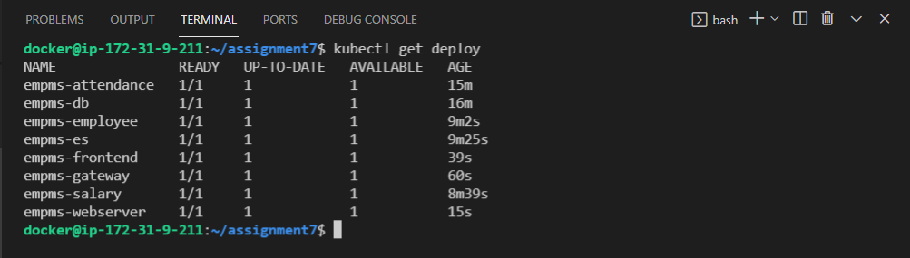
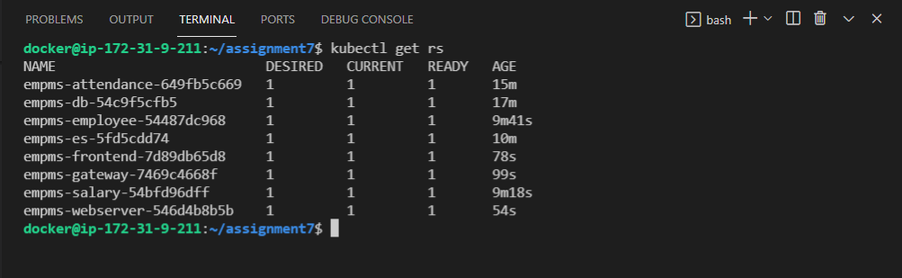
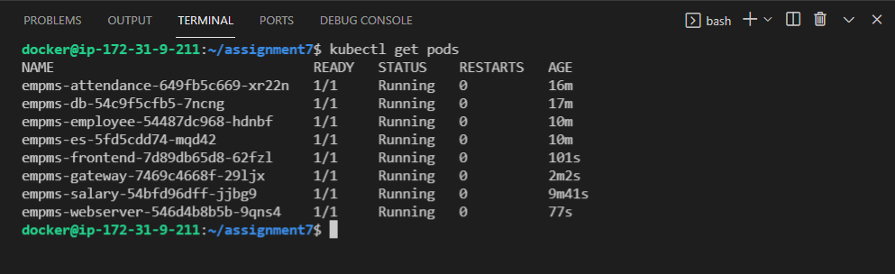
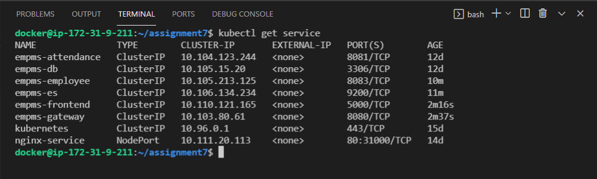

## Assignment 7

- In this assignment we will try to understand what Deployments are in K8s.
- This time try to deploy OT-Microservice Application using Deployments

--------------------------------------------------------------------------------------

#### Below are the Deployment created 

#### Below are the ReplicaSet created

#### Below are the Pod created 

#### Below are the Service created 

